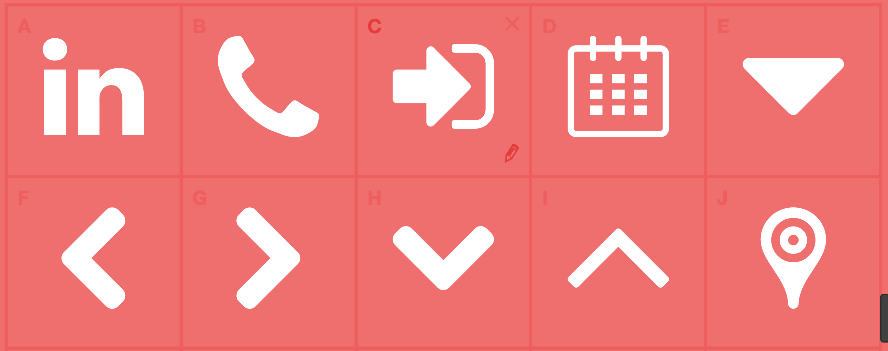

# Reconstructing Baird Partners Landing Page 

## About 

As part of a technical assessment, it has been my task to recreate the [Baird Partners Landing Page](https://www.bairdpartners.com/).

## Tech Used

As part of the assessment I'm only using:

**HTML**
**CSS**

## Javascript needed for
* Image slider 
* Return to top button
* Language switcher

## Notes

**Icons** 
The icons for the project were created using [Glyphter](https://glyphter.com/) a font icon generator, here is the character reference table for Glyphter.ttf

**Media Queries**
There are a number of media queries in the CSS, including two classes (mobile/mobile a) to enable the page to scale correctly.
